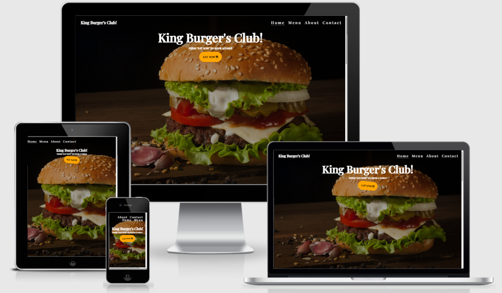
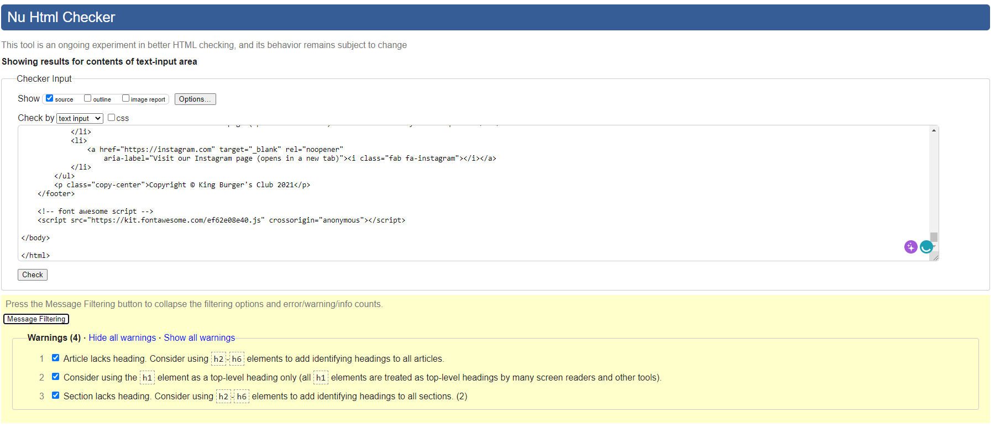
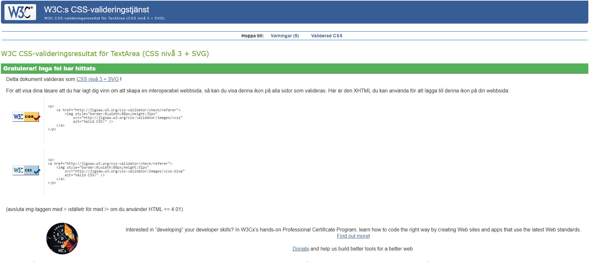
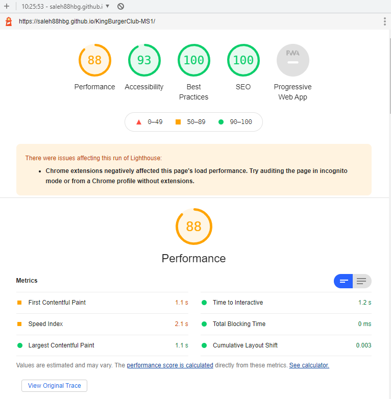
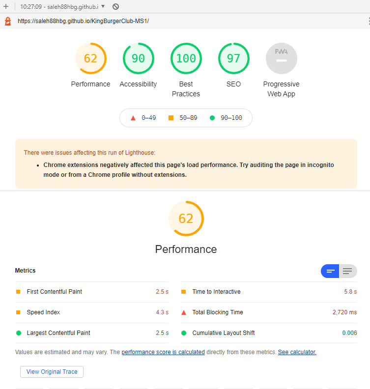

#                                King Burger's club

## [View the live project here.](https://saleh88hbg.github.io/KingBurgerClub-MS1/)

## User Experience (UX)

I have designed this webpage using HTML and CSS, the UX was kept clean whit purpose to drag attention on making a booking.
The website is responsive and user friendly and easy to understand the purpose of the site.
I've included the feature of social media links on the footer section so one can navigate directly to the social media pages of the company 
and ggoogle map is deployed to our visiting address (fixed address).

## Technologies Used

### Languages

[HTML5](https://en.wikipedia.org/wiki/HTML5)
Was used for the overall structure of the website.

[CSS3](https://en.wikipedia.org/wiki/Cascading_Style_Sheets)
Was used for styling the elements and content on the website.

### Frameworks, IDE, Libraries and Programs

[Google Fonts:](https://fonts.google.com/) - 
Google fonts were used to import the 'Barlow Condensed' font into the style.css file which is used on all pages throughout the project.

[GitHub:](https://github.com/)
GitHub was used to store the projects code after being pushed from Git.

[Gitpod:](https://www.gitpod.io/)
Was used to develop and write my project and push all commits through integrated "git" to Github.

## Content

The content (Menu, About) on the page was written by me "Saleh Chehade".
The contact and map location is a "fixed address".

## Testing W3C

The W3C Html Validator and W3C CSS Validator Services were used to validate the code. 
No errors were found in the code, only few warnings were the W3C html consider that heading elements need to be continued. 

## Testing Lighthouse

I also used Lighthouse to audit the performance of the websites. First picture is testing of desktop and the second for mobile.

## Features

1. Basic and clean UX.
2. Mobile responsive platform.
3. Google map for location

### Features Left to Implement

In a near future I would like to implement:

1. Add table booking
2. Add Order menu
3. Add coupon function
4. Add payment function
5. Add member database

To complete that i need to learn more programming languages to make the website more interactive and functional.

## Tools and editors:

[Google fonts:](https://fonts.google.com/)
Font Family: "Playfair" for the entire project.

[Font Awesome:](https://fontawesome.com/)
The icon combination used on the button and (get to know us section).

[a:hover](https://www.w3schools.com/cssref/sel_hover.asp)
Hover function on nav bar and icons. 

[Wiggle button](https://codepen.io/donovanh/pen/KwEQdQ)
I used wiggle button to attract the user to approach and proceed by click the button to make a booking.

[Google map api:](https://developers.google.com/maps/documentation/javascript/adding-a-google-map)
The map was deployed to give the user a location and address to the restaurant (fixed address)

## Compatibility

* The website was tested: 

* Browser: Edge and Chrome : No problems detected
* DevTools: Chrome
* Chrome lighthouse
* W3C

## Content

The content was written by me.

### The images and information were obtained from:

1. https://www.w3schools.com/ info
2. https://css-tricks.com/ info
3. https://blog.hubspot.com/website/css-animation-examples info
4. https://developer.mozilla.org/en-US/docs/Web/CSS info
5. https://ishadeed.com/article/learn-box-alignment/ info
6. https://tinypng.com/ Photo compress
7. https://www.unsplash.com/ Photo

## Credits

* Mentor Tim Nelson
* Google

---

Saleh Chehade 2021-06-30 Happy coding!
